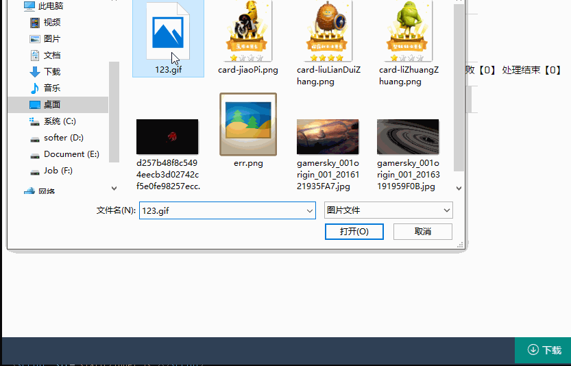
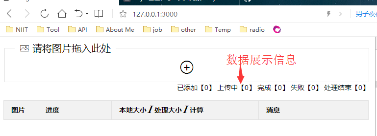

# z_img 

图片工具【持续更新中-0.0.2】

1. 下载项目包 > 定位到项目根目录

2. `npm i`

3. `node index.js`

4. 浏览器打开：`127.0.0.1:3000`，如果端口被占用，在`lib/index.js => port = 3000;`修改

# 功能说明
 
1. 压缩图片




# 流程说明

* 图片压缩说明：

 1. 用户每次打开新的页面都会生成一个`session`

 2. 用户上传第一张图片时，生成`session`对应的文件夹,文件夹位于 `lib/express/compass`

 3. 同时生成2个文件夹`lib/express/compass/{{文件名}}`(存放源文件)和`lib/express/compass/{{文件名}}/compass`(存放压缩文件)

 4. 压缩后会返回图片的`base64`字符串,并添加了`data:image/**;base64,`数据头：`lib/express/upload.js => (v.data = 'data:' + contentType + ';base64,' + v.data;)`

 5. 数据返回用户后，`lib/express/static/index.js => _zip.add(res.name, res.data);`添加压缩文件

  *提示：由于jszip压缩的base64字符串不需要文件头，所以去掉文件头信息 `lib/express/static/index.js => data.replace(/data.+base64,/, '')`*

# `lib/imagemin`

 图片压缩核心
 仅对[imagemin](https://www.npmjs.com/package/imagemin)包进行了再次包装。

**依赖包**

>> [imagemin](https://www.npmjs.com/package/imagemin) 、[imagemin-mozjpeg](https://www.npmjs.com/package/imagemin-mozjpeg) 、[imagemin-pngquant](https://www.npmjs.com/package/imagemin-pngquant) 、[co](https://www.npmjs.com/package/co) 、[fs](http://nodejs.cn/api/fs.html)

**使用方式**

`cosnt imagemin = require('./lib/imagemin');`

**API**

文件路径问题详情查看：[imagemin](https://www.npmjs.com/package/imagemin)

```
 cosnt imagemin = require('./lib/imagemin');

 //imagemin.compass(input,output);

 // input: 文件目录或者文件地址， './image/*.{jpg,png}' || './image/1.jpg' || ['./image/*.{jpg,png}','./image/1.jpg']

 // output: 文件输出目录 './image/compass' 默认：'imagemin/temp'

 imagemin.compass('./image/*.{jpg,png}','./image/compass')
    .then(v =>{
        if(v.status){
            console.log(v.data); //[{ data: buffer数据, path:图片路径 }] 路径为output所填路径加图片名称 './image/compass/1.jpg'
        }else{
            console.log(v.error); //错误消息
        }
    });

```

# 日志(时间倒叙)

#### 2017-05-08

1. 添加数据展示信息

**

2. 优化用户文件夹创建时间，之前是在用户访问页面时创建文件夹，现在修改为用户上传第一张图片的时候创建，避免用户一直刷新。

3. 用户已打开页面，但是服务器重启过，导致用户`session`失效，bug修复。

4. 添加图片预览，添加图片后点击列表中的图片可以在独立标签打开页面预览图片。

5. 图片限制`30M`，并发修改为`1`